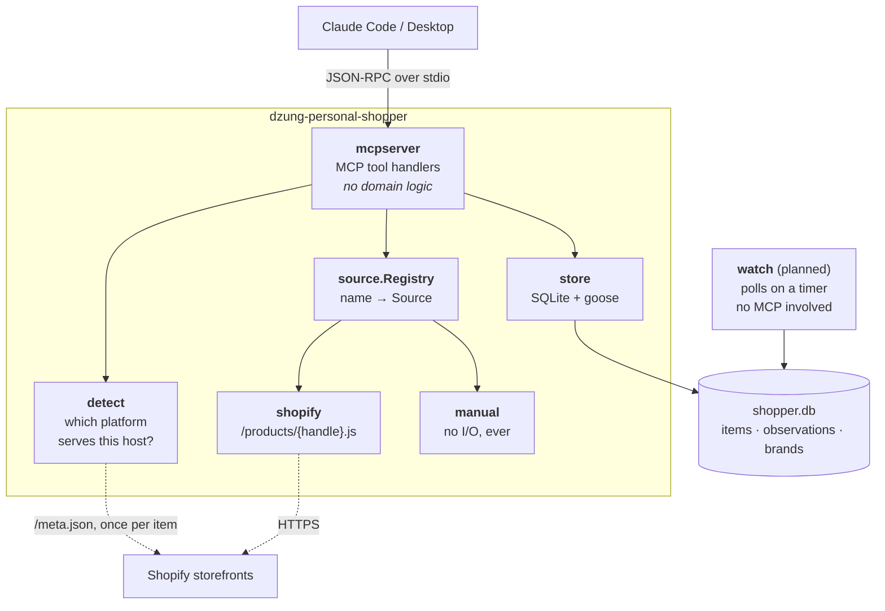

# dzung-personal-shopper

[](https://github.com/dzungthan01/dzung-personal-shopper/actions/workflows/ci.yml)

An [MCP](https://modelcontextprotocol.io) server that tracks a personal shopping wishlist:
what you want, what it costs now, what it has cost before, and whether your size is back in
stock. Written in Go.

You talk to it through Claude:

> **you:** add https://frame-store.com/products/l-homme-slim-lmh0467-ridg to my wishlist, size 30
>
> **claude:** Added "L'Homme Slim — Ridgeway" as item 1 at $173.00 (was $248.00). Size 30 is in stock.
>
> **you:** what's on my wishlist?
>
> **claude:** 1 item. L'Homme Slim — Ridgeway, $173.00, on sale, size 30 available.

---

## Status

MVP. Wishlist storage, automatic price reads from Shopify storefronts, manual entry for
everything else, and price history all work. Background monitoring and cross-site search are
designed but not built — see [Future improvements](#future-improvements).

```bash
go install github.com/dzungthan01/dzung-personal-shopper/cmd/dzung-personal-shopper@latest

dzung-personal-shopper migrate     # create the database
claude mcp add dzung-personal-shopper -- dzung-personal-shopper start
```

---

## General functionality

Seven tools, exposed over MCP:

| Tool | What it does |
|---|---|
| `inspect_url` | Reports whether a store can be read automatically, before you commit to adding it |
| `add_item` | Adds a product, detects the platform, and records the current price if it can |
| `list_items` | The wishlist with latest price, sale status, and whether *your* size is in stock |
| `check_item` | Re-reads one item now and reports what changed since last time |
| `record_snapshot` | Logs a price you read yourself — how blocked retailers get tracked |
| `get_price_history` | Every recorded price, plus lowest and highest ever seen |
| `archive_item` | Removes an item from the active list, keeping its history |

### Which stores can be read automatically

Any Shopify storefront, which is a larger set than it sounds. Verified by probing
`/meta.json` for a `myshopify_domain`:

| Automatic | Manual entry only |
|---|---|
| FRAME, Veronica Beard, Khaite, STAUD | Mytheresa, SSENSE, NET-A-PORTER |
| AGOLDE, MOTHER, Rails, Anine Bing | Aritzia, Sezane, Sephora, lululemon |
| Cuyana, Universal Standard, Alo Yoga | Reformation, Madewell, Quince |
| Brooklinen, Parachute, Floyd, Bearaby | The RealReal, Skims, Ganni |

The right-hand column runs custom platforms behind Cloudflare or Akamai. Those are not
scraped — see [Design decisions](#4-blocked-retailers-are-designed-around-not-scraped).

---

## High level architecture



Two processes, one database. That split is the central constraint — see below.

### Layout

```
cmd/dzung-personal-shopper/   subcommands: start · migrate · version
internal/
  detect/     platform detection via /meta.json
  model/      shared types: Item, Observation, Snapshot, Variant, Brand
  store/      SQLite, embedded goose migrations
  source/     the Source interface
    shopify/  reads any Shopify storefront
    manual/   marker source; never performs I/O
  mcpserver/  MCP translation layer
```

`cmd/` is convention. `internal/` is enforced by the compiler: nothing outside this module can
import those packages, so their APIs stay free to change.

---

## Design decisions

### 1. Two processes, one database

An MCP stdio server **only runs while its client runs it**. Quit Claude Code and the server
dies, so nothing can check prices at 3am.

**Tradeoff:** a single always-on daemon would be simpler to reason about, but then Claude would
have to talk to it over HTTP instead of stdio, adding ports, auth and lifecycle management to a
personal tool. Instead: `start` serves MCP, `watch` polls on a timer, and they share a SQLite
file in WAL mode. They never talk to each other. Coordination cost drops to zero at the price of
one shared file.

### 2. Observations are append-only

Every price check **inserts** a row. Nothing is ever updated.

```
items         one row per thing you want          mutable
observations  one row per price check             append-only
```

**Tradeoff:** storing a single `current_price` column would be smaller and simpler. But then
"has this ever been cheaper?" is unanswerable, a price drop needs separate bookkeeping to
detect, and the 14-day price-match window becomes its own subsystem instead of a `WHERE` clause.

The cost is disk, and it was measured rather than guessed: **50 items polled daily for a year is
4.8 MB**, at 261 bytes per row. That is not a real constraint at personal scale, so history wins.

### 3. Money is `int64` minor units, never a float

`$173.00` is stored as `17300`.

**Tradeoff:** floats read more naturally in code. They are also wrong — `0.1 + 0.2 != 0.3` — and
this program's entire purpose is comparing prices. Rounding error in the one value that matters
is not an acceptable trade for nicer-looking arithmetic.

This also drove the choice of Shopify endpoint. Of the three available, only one returns both
stock status *and* integer prices:

| Endpoint | `available` | price format |
|---|---|---|
| `/products.json` | yes | `"173.00"` string |
| `/products/{handle}.json` | **no** | `"173.00"` string |
| **`/products/{handle}.js`** | **yes** | **`17300` integer** |

### 4. Blocked retailers are designed around, not scraped

Mytheresa, SSENSE and NET-A-PORTER return `403` to automated requests. Defeating that is against
their terms, breaks constantly, and would make the codebase's central feature an arms race.

**Tradeoff:** convenience. Those prices do not update on their own. In exchange, `record_snapshot`
accepts a price read off a page you or Claude already loaded, so those items are still tracked,
still get price history, and still answer "is this a good price?" — with no fragile scraping
anywhere in the codebase. `manual.Fetch` performs no I/O at all; that is the point.

### 5. Source selection happens once per item, not once per poll

The `Source` interface deliberately has **no `CanHandle(url)` method**, though the original design
did. Answering "is this host Shopify?" requires a network call, so a supposedly cheap predicate
would do I/O on every fetch, forever.

Detection runs once, when the item is added, and the answer is stored in `items.source`.

**Tradeoff:** if a store migrates platforms, its items need re-detecting. Against that: 50 items
polled hourly is 1,200 polls a day, so a per-poll probe would mean **438,000 extra requests a year**
to re-answer a question whose answer never changes. Re-detection is a rare manual fix; the
request volume was permanent.

### 6. LLM-shaped work stays on the Claude side

Tools return **structured facts**, never prose the model has to re-parse, and the server makes no
LLM calls of its own.

**Tradeoff:** the server cannot handle messy input by itself — parsing a pasted list of sizes is
Claude's job before calling `record_snapshot`. In return the Go code stays deterministic, unit
testable without a model in the loop, and free of API keys and latency.

### 7. Pure-Go SQLite

`modernc.org/sqlite` rather than the faster cgo-based `mattn/go-sqlite3`.

**Tradeoff:** measurably slower. Also: no C toolchain, trivial cross-compilation, and
`go install` produces one self-contained binary with the migrations embedded. For a personal
tool doing dozens of queries a day, startup simplicity beats throughput.

### 8. Tests never touch the network

Every HTTP interaction is tested against `httptest` servers with recorded payloads. The Shopify
fixture is trimmed from a real FRAME response, including the case that exposed a real bug: FRAME's
options are `Color / Pants length / Size`, so **size is `option3`** and `option1` is a colour name.
A parser assuming `option1` records your jeans size as `"Ridgeway"`.

**Tradeoff:** fixtures drift from reality, and a store changing its API shape will not fail CI.
The alternative — live requests in tests — means a flaky suite that fails when a store is slow
and hammers third parties on every push. Fixtures win; drift is caught by using the tool.

---

## Future improvements

- [ ] **Background watcher** — `watch` subcommand polling on a timer, with jitter and per-store rate limits
- [ ] **Diff engine** — price drop, restock, and your-size-back detection
- [ ] **Push notifications** — ntfy.sh by default, behind a `Notifier` interface
- [ ] **Idempotent alerting** — dedupe keys so a flapping price does not send forty pings
- [ ] **Cross-site search** — find the same item elsewhere, ranked, for the human to verify
- [ ] **Listing trust signals** — rank matches by value rather than raw price, using platform authentication programs, seller reputation, and price-anomaly detection against stored history. Advisory only; never declares an item genuine
- [ ] **Automatic brand → domain resolution** — guess `<brand>.com`, verify with `inspect_url`. Tested at 3/8 resolved with **zero false positives**; a wrong guess costs one request and falls back to manual
- [ ] **Browser extension** — add to wishlist while browsing. Defeats bot protection without fighting it: the page is already rendered in an authenticated session. Posts the same `Snapshot` the manual source already accepts
- [ ] **Purchase tracking and price matching** — 14-day window detection, and drafting the email to customer service
- [ ] **Membership perks** — import discount codes and stored-value cards, match them against wishlist items
- [ ] **Retention** — user-invoked `prune`, never automatic
- [ ] **Affiliate feeds** — CJ / Rakuten / Impact for legitimate bulk catalog access to blocked retailers
- [ ] **Size normalization** across IT / FR / UK / US
- [ ] **Multi-currency** — pin a region per item so EUR/USD switching is not read as a price drop

## What this deliberately does not do

- Defeat bot protection, solve CAPTCHAs, or rotate identities to evade rate limits
- Scrape retailers whose terms forbid it
- Buy anything, or hold payment credentials
- Judge whether a secondhand listing is authentic — it surfaces evidence for a human decision

## Development

```bash
go build ./...
go vet ./...
go test ./...

npx @modelcontextprotocol/inspector ~/go/bin/dzung-personal-shopper start
```

See [PLAN.md](PLAN.md) for the full design document and [CLAUDE.md](CLAUDE.md) for conventions.
