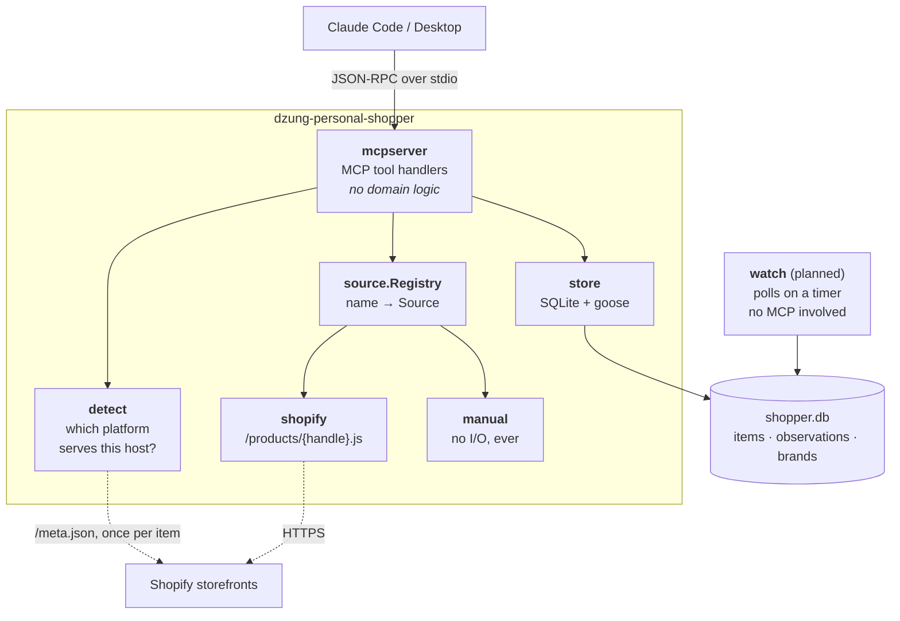

# dzung-personal-shopper

[](https://github.com/dzungthan01/dzung-personal-shopper/actions/workflows/ci.yml)

An [MCP](https://modelcontextprotocol.io) server that tracks a personal shopping wishlist:
what you want, what it costs now, what it has cost before, and whether your size or colour is back in
stock. Written in Go.

You talk to it through Claude:

> **you:** add https://frame-store.com/products/l-homme-slim-lmh0467-ridg to my wishlist, size 30
>
> **claude:** Added "L'Homme Slim — Ridgeway" as item 1 at $173.00 (was $248.00). Size 30 is in stock.
>
> **you:** what's on my wishlist?
>
> **claude:** 1 item. L'Homme Slim — Ridgeway, $173.00, on sale, size 30 available.

---

## This is an MVP version that can do

* **Track a wishlist** — add any product URL, keep it with the size or colour you want, archive what you
  no longer want without losing its history
* **Read prices automatically from any Shopify storefront** — price, sale price, per-size stock,
  no API key or account required
* **Track retailers that block automated requests** — Mytheresa, SSENSE and similar are tracked
  by hand through `record_snapshot`, from a page you or Claude has already loaded
* **Keep full price history** — every check is appended, never overwritten, so "has this ever
  been cheaper?" is answerable
* **Report what changed** — `check_item` re-reads an item and tells you the price moved, by how
  much, and whether it came back in stock
* **Tell you if *your* size or colour is in stock**, not just whether the product exists. Track
  one product in several sizes or colours by adding it once per variant
* **Watch in the background and push to your phone** — a `watch` process polls on a timer, works
  out what counts as news, and sends it. A push that fails is retried on the next pass
* **Ask Claude what's new** — `list_alerts` shows what the watcher found, in the same words the
  push used, and `ack_alerts` clears them
* **Detect whether a store is readable before you commit** — `inspect_url` probes a host and says
  whether prices will update on their own

Not yet built: cross-site price comparison and the browser extension. Both are designed and
specified — see [Roadmap](#roadmap).

### Install

```bash
go install github.com/dzungthan01/dzung-personal-shopper/cmd/dzung-personal-shopper@latest

dzung-personal-shopper migrate     # create the database
claude mcp add dzung-personal-shopper -- dzung-personal-shopper start
```

### Running the watcher

`start` only runs while Claude is open, so a second process does the polling.

```bash
dzung-personal-shopper watch --once      # one pass now, prints what it found
dzung-personal-shopper watch             # keep running, one pass a day
```

With no notification service configured it logs alerts instead of pushing them, so it works
with no setup at all.

**To get pushes on your phone**, install the [ntfy app](https://ntfy.sh) and subscribe it to a
topic. A topic name is the only credential on the public server, so pick something unguessable:

```bash
export SHOPPER_NTFY_TOPIC=shopper-7f3k9q2m      # not "dzung-shopper"
dzung-personal-shopper watch --once
```

`--ntfy-server` and `--ntfy-token` point it at a private or self-hosted server instead. The ntfy
server does not run natively on macOS; self-hosting means Docker, and phones then have to reach
that machine, so the public server is the simpler choice for a laptop.

**To keep it running across reboots**, use the launchd file in `deploy/`:

```bash
cp deploy/com.dzungthan01.shopper.watch.plist ~/Library/LaunchAgents/
# edit it: replace YOUR-USERNAME and YOUR-NTFY-TOPIC
launchctl bootstrap gui/$(id -u) ~/Library/LaunchAgents/com.dzungthan01.shopper.watch.plist
launchctl print gui/$(id -u)/com.dzungthan01.shopper.watch | head    # check it is alive
tail -f ~/Library/Logs/dzung-personal-shopper.log                    # watch it work
launchctl bootout gui/$(id -u)/com.dzungthan01.shopper.watch         # stop it
```

On a laptop the watcher only runs while the machine is awake, so a drop overnight is noticed
the next time it wakes. For markdowns, which last days, late is fine.

### The nine tools

| Tool | What it does |
|---|---|
| `inspect_url` | Reports whether a store can be read automatically |
| `add_item` | Adds a product, detects the platform, records the current price if it can |
| `list_items` | The wishlist with latest price, sale status, and whether your variant is in stock |
| `check_item` | Re-reads one item now and reports what changed |
| `record_snapshot` | Logs a price you read yourself |
| `get_price_history` | Every recorded price, plus lowest and highest ever seen |
| `archive_item` | Removes an item from the active list, keeping its history |
| `list_alerts` | What the watcher found: drops, sales, restocks |
| `ack_alerts` | Marks alerts read so they stop showing as new |

### Which stores can be read automatically

Verified by probing each host's `/meta.json` for a `myshopify_domain`.

* **Automatic (Shopify storefronts)** — FRAME, Veronica Beard, Khaite, STAUD, AGOLDE, MOTHER,
  Rails, Anine Bing, DÔEN, Farm Rio, LoveShackFancy, Totême, Cuyana, Universal Standard,
  Girlfriend Collective, Marine Layer, Alo Yoga, Outdoor Voices, Brooklinen, Parachute, Floyd,
  Bearaby

* **Manual entry only (custom platforms behind bot protection)** — Mytheresa, SSENSE,
  NET-A-PORTER, The RealReal, Aritzia, Sezane, Sephora, lululemon, Reformation, Madewell,
  Quince, Skims, Ganni, Vuori

The second group is not scraped. See [design decision 3](#3-blocked-retailers-are-designed-around-not-scraped).

Any store can be checked in one command. A Shopify storefront advertises a `myshopify_domain`;
anything else returns a `403`, a `404`, or JSON without that field:

```bash
curl -s "https://frame-store.com/meta.json"
# {"name":"FRAME","currency":"USD","myshopify_domain":"frame-denim.myshopify.com", ...}

curl -s -o /dev/null -w "%{http_code}\n" "https://www.ssense.com/meta.json"
# 403        (Cloudflare)

curl -s "https://www.sezane.com/meta.json"
# {}         valid JSON, no shop fields - which is why detection keys on
#            myshopify_domain rather than on a 200 status
```

This is exactly what `inspect_url` automates.

---

## High level architecture



```
cmd/dzung-personal-shopper/   subcommands: start · migrate · version
internal/
  detect/     platform detection via /meta.json
  model/      shared types: Item, Observation, Snapshot, Variant, Brand
  store/      SQLite, embedded goose migrations
  source/     the Source interface
    shopify/  reads any Shopify storefront
    manual/   marker source; never performs I/O
  mcpserver/  MCP translation layer
```

`cmd/` is convention. `internal/` is enforced by the compiler: nothing outside this module can
import those packages, so their APIs stay free to change.

---

## Design decisions

### 1. Two processes, one database

`start` serves MCP over stdio; a planned `watch` polls on a timer; they share one SQLite file in
WAL mode and never talk to each other.

**Pros**
* An MCP stdio server only lives as long as its client. This is the only way prices can be
  checked while Claude is closed.
* Zero coordination code: no IPC, no ports, no message queue, no service discovery.
* Either process can crash or be restarted without affecting the other.
* One binary, so there is nothing extra to install or version.

**Cons**
* Two things to keep running, and `watch` failing silently is possible until a `doctor`
  subcommand exists.
* SQLite write contention is real, though WAL makes it a non-issue at this scale.
* Both processes must resolve the same database path, which is why it is XDG-based rather than
  relative to the working directory.

**Alternative rejected: one always-on daemon that also serves MCP over HTTP**

A *daemon* is a program that runs continuously in the background with no terminal, started at
boot by `launchd` or `systemd`. Here it would poll prices and also listen on a local port for
Claude, instead of being launched on demand over stdio.

* *Pros:* a single process to supervise; state lives in memory; no shared-file concerns.
* *Cons:* introduces a listening port, authentication, and TLS decisions to a personal tool that
  otherwise needs none. Claude Code's stdio transport is the simplest thing that works, and
  giving it up to avoid one shared file is a bad trade.

**Alternative rejected: cron invoking a one-shot subcommand**

*Cron* is the OS scheduler: it launches a command on a schedule, lets it finish, and keeps
nothing running in between.

* *Pros:* no long-lived process at all; the OS handles scheduling.
* *Cons:* the program forgets everything between runs, and polite polling needs memory — "I hit
  this store two seconds ago", "this store returned a 429, back off" — so rate limiting and
  backoff have to be persisted and reloaded every run, badly reimplementing what a long-lived
  process gets for free. Cron also fails quietly: a minimal environment, no output by default,
  and the classic discovery three weeks later that it never ran.

|  | Scheduling state | Setup cost | Fails visibly? |
|---|---|---|---|
| **A: two processes** | in memory, free | one launchd plist | yes, it is a live process you can inspect |
| **B: one daemon** | in memory, free | port + auth + TLS decisions | yes |
| **C: cron** | must persist and reload | one crontab line | notoriously not |

A gets B's in-memory state without B's networking, and avoids C's silent failures. The price is
one shared SQLite file, which the watcher needs regardless of which option is chosen.

### 2. Observations are append-only

Every price check inserts a row. Nothing is ever updated.

```
items         one row per thing you want          mutable
observations  one row per price check             append-only
```

**Pros**
* Price history is free, and "was it ever cheaper?" becomes a `MIN()` rather than a feature.
* A price drop is a comparison of the two newest rows — no separate change-tracking table.
* The 14-day price-match window becomes a `WHERE fetched_at > ...` clause instead of a subsystem.
* Anomaly detection for the planned trust signals gets a real price distribution for free.
* Bugs are diagnosable after the fact, because nothing was destroyed.

**Cons**
* Storage grows without bound.
* "Current price" is a query, not a column, so every read path joins to the newest observation.
* No unique constraint stops a redundant identical reading being stored.

**Alternative rejected: a mutable `current_price` column on `items`**
* *Pros:* smaller, simpler, one row per item, trivially indexed.
* *Cons:* destroys the history that makes the tool worth having. Every feature past "what does it
  cost right now" — price matching, anomaly detection, judging whether a sale is real — would
  need its own history table anyway, reinventing this design badly.

Storage was measured rather than guessed: **50 items polled daily for a year is 4.8 MB**, at 261
bytes per row. That is not a real constraint, so history wins.

### 3. Blocked retailers are designed around, not scraped

Mytheresa, SSENSE and NET-A-PORTER return `403` to automated requests. `manual.Fetch` performs no
I/O at all; prices for those stores arrive through `record_snapshot`, read off a page a human or
Claude already loaded.

**Pros**
* No terms-of-service violation, and no adversarial relationship with any retailer.
* Nothing to break when a store changes its bot-protection vendor — there is no scraper to break.
* No headless browser, no proxy pool, no CAPTCHA solving: the dependency tree and the attack
  surface both stay small.
* Those items still get full price history and still answer "is this a good price?"
* It generalises: any store, anywhere, can be tracked the moment a human can see the page.

**Cons**
* Prices for those retailers do not update on their own — which is most luxury retail.
* Data quality depends on whoever typed it in.
* The workflow requires a human in the loop, which is exactly what the browser extension in the
  roadmap is meant to fix.

**Alternative rejected: headless browser scraping (Playwright or similar)**
* *Pros:* full automation for every retailer; no manual step.
* *Cons:* against those sites' terms; needs a browser binary, so no more single-file
  `go install`; breaks whenever bot protection changes; and makes the project's central technical
  achievement "evading detection", which is not a thing worth building a portfolio around.

**Alternative rejected: a third-party scraping API**
* *Pros:* someone else maintains the evasion; a clean HTTP interface.
* *Cons:* outsources the terms-of-service problem without solving it, adds per-request cost and a
  vendor dependency, and puts a paid service on the critical path of a personal tool.

### 4. Source selection happens once per item, not once per poll

The `Source` interface deliberately has **no `CanHandle(url)` method**, though the original design
did. Detection runs when an item is added, and the answer is stored in `items.source`; after that,
choosing a fetcher is a map lookup.

**Pros**
* One `/meta.json` probe per item, ever, instead of one before every fetch.
* Source selection costs nanoseconds and cannot fail, so no error path in the hot loop.
* Keeps the tool a well-behaved client, which matters because the whole project depends on
  unauthenticated endpoints that stores are under no obligation to keep open.
* The interface stays honest: a method named `CanHandle` should not open a socket.

**Cons**
* A store migrating platforms leaves stale rows that need re-detecting.
* The decision is invisible in the database as anything but a string, so a wrong value is a
  silent misconfiguration until a fetch fails.

**Alternative rejected: `CanHandle(url) bool` on the interface, evaluated per fetch**
* *Pros:* self-configuring; a platform migration heals itself; no state to go stale.
* *Cons:* the predicate has to do network I/O to answer. At 50 items polled hourly — 1,200 polls
  a day — that is **438,000 extra requests a year** to re-answer a question whose answer never
  changes. Re-detection is a rare manual fix; the request volume would have been permanent.

---

### Smaller decisions

**Money is `int64` minor units, never a float.** `$173.00` is stored as `17300`. Floats read more
naturally and are also wrong: `0.1 + 0.2 != 0.3`, and this program exists to compare prices. This
drove the endpoint choice too — of Shopify's three product endpoints, only
`/products/{handle}.js` returns both stock status *and* integer prices:

| Endpoint | `available` | price format |
|---|---|---|
| `/products.json` | yes | `"173.00"` string |
| `/products/{handle}.json` | **no** | `"173.00"` string |
| **`/products/{handle}.js`** | **yes** | **`17300` integer** |

Verified against a live store rather than assumed:

```bash
curl -s "https://frame-store.com/products/l-homme-slim-lmh0467-ridg.js"
```

```jsonc
{
  "title": "L'Homme Slim -- Ridgeway",
  "vendor": "frame-denim",
  "price": 17300,              // integer minor units, not "173.00"
  "compare_at_price": 24800,   // on sale
  "available": true,
  "featured_image": "//cdn.shopify.com/...",   // protocol-relative; needs an https: prefix
  "options": [
    {"name": "Color",             "position": 1},
    {"name": "Pants length type", "position": 2},
    {"name": "Size",              "position": 3}   // size is NOT option1
  ],
  "variants": [
    {"title": "Ridgeway / 32\" / 28", "option1": "Ridgeway", "option3": "28",
     "sku": "LMH0467-RIDG-28", "price": 17300, "available": true}
  ]
}
```

Two parser requirements fall out of that payload, and both have tests: `featured_image` is
protocol-relative and renders as a broken image without an `https:` prefix, and the size axis has
to be resolved through `options` — here `option1` is a colour.

**LLM-shaped work stays on the Claude side.** Tools return structured facts, never prose, and the
server makes no model calls of its own. Parsing a messy pasted size list is Claude's job before it
calls `record_snapshot`. The Go code stays deterministic, testable without a model in the loop,
and free of API keys and latency.

**Pure-Go SQLite** (`modernc.org/sqlite`, not the faster cgo `mattn/go-sqlite3`). Measurably
slower, but needs no C toolchain, cross-compiles trivially, and lets `go install` produce one
self-contained binary with migrations embedded. For dozens of queries a day, startup simplicity
beats throughput.

**Tests never touch the network.** Every HTTP interaction runs against `httptest` servers with
recorded payloads. The Shopify fixture is trimmed from a real FRAME response, including the case
that caught a real bug: FRAME's options are `Color / Pants length / Size`, so **size is
`option3`** and `option1` is a colour name — a parser assuming `option1` records your jeans size
as `"Ridgeway"`. Fixtures drift from reality, but live requests in tests mean a suite that fails
when a store is slow and hammers third parties on every push.

**Currency is cached in a `sync.Map`, not a plain map.** The product endpoint omits currency, so
it comes from `/meta.json` — fetched once per store, then read on every poll forever. That cache
has to be safe for concurrent use, and here is the evidence for why.

Two tool calls were sent down one stdio connection, `id: 3` then `id: 4`:

```bash
{ printf '%s\n' '{"jsonrpc":"2.0","id":1,"method":"initialize","params":{"protocolVersion":"2025-11-25","capabilities":{},"clientInfo":{"name":"probe","version":"1"}}}'
  printf '%s\n' '{"jsonrpc":"2.0","method":"notifications/initialized"}'
  printf '%s\n' '{"jsonrpc":"2.0","id":3,"method":"tools/call","params":{"name":"inspect_url","arguments":{"url":"https://frame-store.com/products/x"}}}'
  printf '%s\n' '{"jsonrpc":"2.0","id":4,"method":"tools/call","params":{"name":"inspect_url","arguments":{"url":"https://www.ssense.com/x"}}}'
  sleep 6; } | dzung-personal-shopper start
```

The replies came back in the other order:

```
id 4: www.ssense.com         unknown
id 3: frame-store.com        shopify
```

`id: 4` finished first because SSENSE rejects the request immediately with a `403`, while FRAME
served a real response. **The handlers ran at the same time** — the server did not wait for one
call to finish before starting the next. So two `check_item` calls really can touch the currency
cache simultaneously.

That rules out a plain `map`. A Go map read and written concurrently does not just return a wrong
value; the runtime detects it and kills the process:

```
fatal error: concurrent map read and map write
```

It is a `fatal error`, not a panic — `recover()` cannot catch it, and the program dies mid-request.

`sync.Map` does the locking internally, so the crash is impossible. Its documented sweet spot is
*"the entry for a given key is written once but read many times"*, which is exactly a store's
currency. The cost is that it predates generics: it stores `any`, so reads need a type assertion
(`cached.(string)`).

**Why not `map[string]string` guarded by a `sync.RWMutex`?** It would also work, and it would be
type-safe with no assertion. It was not chosen because it is more code that must stay correct by
hand — every read needs `RLock`/`RUnlock` and every write `Lock`/`Unlock`, a forgotten unlock
deadlocks the server, and taking a read lock where a write happens reintroduces the race the lock
was meant to prevent. `sync.Map` makes those mistakes unavailable. The tradeoff would be worth
revisiting if this cache ever needed iteration, deletion, or compound updates, where `sync.Map`'s
narrow API stops helping and an explicit mutex reads better.

One known wrinkle, on a cold cache only: two goroutines can both miss and both fetch `/meta.json`,
storing the same value twice. That is a duplicate request, not a wrong answer. Eliminating it
needs per-key locking or `singleflight`, which is more machinery than a once-per-store fetch
justifies.

**One entry per URL and variant, enforced by the database.** `UNIQUE(url, variant)` lets one
product be tracked in several sizes or colours while rejecting true duplicates. Variants are typed
(`M`, `Black / M`), not read from store-specific link parameters, so the same approach works for any
retailer. Where the store publishes its variants, the typed value is checked against them and a bare
`M` is saved under the full name, so `M` and `Light Pistachio / M` land on one entry. A word in front
of a number is ignored when comparing, so `38` matches `IT 38`. `variant` is
`NOT NULL DEFAULT ''` rather than nullable, because SQLite treats every `NULL` as distinct and would
let "any variant" be added twice.

**A table rebuild turns foreign keys off first.** SQLite cannot drop a constraint, so changing
`UNIQUE(url)` meant rebuilding `items`. With foreign keys on, `DROP TABLE items` cascades and
silently deletes every observation and alert. The migration disables them for the rebuild, which
only works because the pool is pinned to one connection: the `PRAGMA` applies per connection, and
goose runs non-transactional statements through the pool. `TestMigration3PreservesHistory` seeds
history at version 2, migrates, and fails with *expected 1, actual 0* if the `PRAGMA` is removed.

**The database is local, and only notifications leave the machine.** No server, no account, no
telemetry; the repo ships the schema, each install grows its own data. The one exception is
deliberate: if you configure ntfy, the text of an alert (item, price, variant) passes through that
server so it can reach your phone, and on the public server a topic name is the only thing
protecting it. Running with no topic keeps everything local, and `--ntfy-server` points at a
private one. The cost of staying local is that two machines mean two independent wishlists —
syncing is the wall the browser extension will eventually hit.

---

## Resource usage

Measured, not estimated.

### Storage

| | |
|---|---|
| Per observation | **261 bytes** |
| 25 items, 1 reading each | 61 KB |
| 50 items polled daily, 1 year | **4.8 MB** |
| 50 items polled hourly, 1 year | ~114 MB |

Nothing here is a constraint at personal scale. Retention is deliberately not implemented; the
history is worth more than the disk.

### Requests to store APIs

Currently on-demand only, so the floor is what you ask for:

| Action | Requests |
|---|---|
| `add_item`, first item from a store | 2 (`/meta.json` + product) |
| `add_item`, later items from the same store | 1 (currency is cached per host) |
| `check_item` | 1 |

With the planned watcher, for 50 items:

| Poll interval | Requests/year | Per store, per hour (10 stores) |
|---|---|---|
| Hourly | 438,000 | 5 |
| Every 6 hours | 73,000 | <1 |
| Daily | **18,250** | <1 |

Daily is the intended default. Prices in fashion retail change on markdown cycles, not minutes,
and a personal tool has no business making five requests an hour to a store that owes it nothing.

### Token cost

The MCP layer's cost to the model's context, measured against a live server:

| | Chars | ~Tokens |
|---|---|---|
| Tool schemas, sent once per session | 11,509 | **~2,877** |
| `list_items` with 25 items | 7,920 | **~1,980** |
| Per wishlist item in that response | 316 | ~79 |

The ~2,900-token schema cost is fixed and paid on every session, which is a direct argument
against adding tools nobody uses. The per-item cost is why `list_items` returns the latest
reading rather than full history, and why `get_price_history` is a separate call.

### Planned: search API budget

Cross-site search will use [Tavily](https://tavily.com) (1,000 credits/month free, no card).
Thirty items re-searched weekly is ~120 queries/month — about 12% of the free tier. Volume is not
the constraint; match quality is.

---

## Roadmap

### Major features

**1. Browser extension for wishlist capture** — the biggest single change to how the tool is used.

An "add to wishlist" button on any product page, writing straight to the database. It defeats bot
protection without fighting it: the page is already rendered, in a real browser, in an
authenticated session, so Mytheresa and SSENSE hand over the price and size availability that a
server-side fetch gets a `403` for. It needs no new backend — the extension posts the same
`Snapshot` the manual source already accepts, to a local endpoint hosted by `watch`, which is why
it depends on the watcher already existing. And it captures the moment of intent, which is when
wishlists actually get filled.

- [ ] Local HTTP endpoint hosted by `watch`
- [ ] Extension with per-site content scripts, falling back to schema.org `Product` markup
- [ ] One-click add with size selection

**2. Cross-site price comparison** — find the same item cheaper somewhere else.

Search for a wishlist item by brand and title across other retailers and resale platforms, and
return ranked candidates with prices. Scoped deliberately: it surfaces links for a human to
verify, and never claims two listings are definitely the same item.

- [ ] `SearchProvider` interface with a Tavily implementation
- [ ] Title and brand normalization, scoring, confidence
- [ ] `find_elsewhere` tool writing to the `matches` table
- [ ] Trust signals so ranking can be by value rather than raw price: platform authentication
      programs, seller reputation, and price-anomaly detection against stored history. Advisory
      only — it never declares an item genuine

### Observability

Nothing currently reports on itself. The measured figures in [Resource usage](#resource-usage)
came from ad-hoc probes, which is fine for a snapshot and useless for noticing that the watcher
has been failing against one store for a week. Capacity questions the tool should answer about
itself rather than requiring a benchmark:

- [ ] Structured logging to stderr, levelled, so `watch` leaves a trail worth reading
- [ ] Request counters per store: attempts, failures, HTTP status distribution, latency
- [ ] Currency cache hit and miss counts, to confirm the once-per-store assumption holds
- [ ] Observations written per day, and database size, to keep the storage projection honest
- [ ] Rate-limit and backoff events, so a store quietly throttling us is visible
- [ ] Token cost per tool response, to catch a schema change bloating every session
- [ ] A `stats` subcommand printing all of the above, and a `doctor` that checks whether the
      schema is current, `watch` is alive, and any API keys still work

### Smaller follow-ups

- [ ] Purchase tracking and 14-day price-match detection, with a drafted email to customer service
- [ ] Membership perks — import discount codes and stored-value cards, match against wishlist items
- [ ] Automatic brand → domain resolution: guess `<brand>.com`, verify with `inspect_url`. Tested
      at 3/8 resolved with **zero false positives**; a wrong guess costs one request and falls
      back to manual
- [ ] User-invoked `prune` for retention, never automatic
- [ ] Affiliate feeds (CJ / Rakuten / Impact) for legitimate bulk catalog access
- [ ] Size normalization across IT / FR / UK / US
- [ ] Multi-currency: pin a region per item so EUR/USD switching is not read as a price drop

## What this deliberately does not do

- Defeat bot protection, solve CAPTCHAs, or rotate identities to evade rate limits
- Scrape retailers whose terms forbid it
- Buy anything, or hold payment credentials
- Judge whether a secondhand listing is authentic — it surfaces evidence for a human decision

## Development

```bash
go build ./...
go vet ./...
go test ./... -race -cover

npx @modelcontextprotocol/inspector ~/go/bin/dzung-personal-shopper start
```

See [PLAN.md](PLAN.md) for the full design document and [CLAUDE.md](CLAUDE.md) for conventions.
