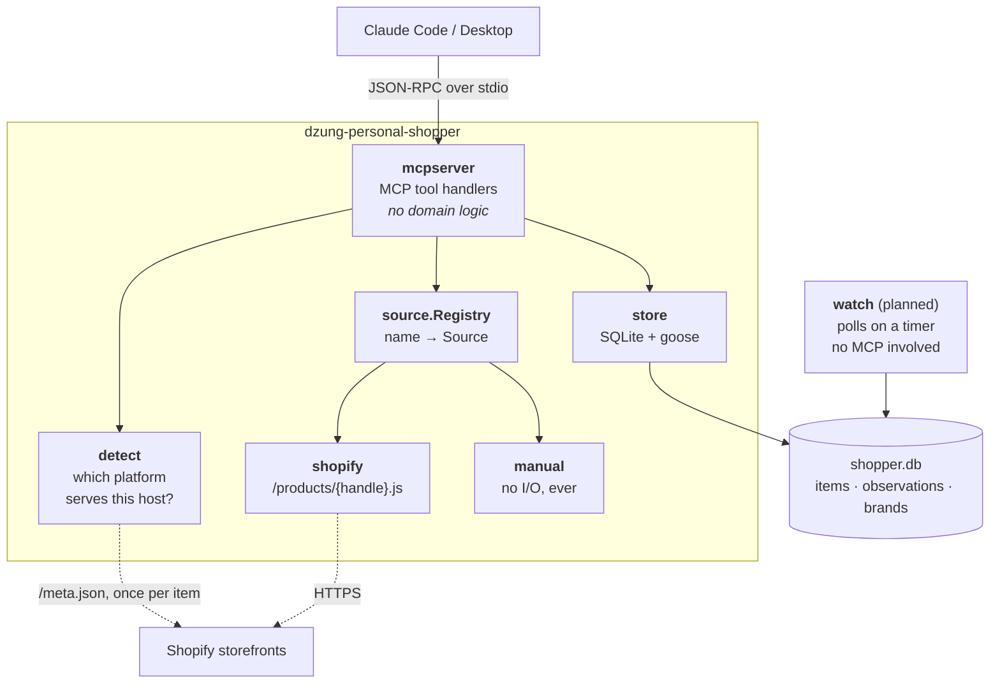

# dzung-personal-shopper

[](https://github.com/dzungthan01/dzung-personal-shopper/actions/workflows/ci.yml)

An [MCP](https://modelcontextprotocol.io) server that tracks a personal shopping wishlist:
what you want, what it costs now, what it has cost before, and whether your size or colour is back in
stock. Written in Go.

You talk to it through Claude:

> **you:** add https://frame-store.com/products/l-homme-slim-lmh0467-ridg to my wishlist, size 30
>
> **claude:** Added "L'Homme Slim — Ridgeway" as item 1 at $173.00 (was $248.00). Size 30 is in stock.
>
> **you:** what's on my wishlist?
>
> **claude:** 1 item. L'Homme Slim — Ridgeway, $173.00, on sale, size 30 available.

## MVP Demo:


https://github.com/user-attachments/assets/eef87d26-8420-42fc-9096-b08f297cadc9


---

## This is an MVP version that can do

* **Track a wishlist** — add any product URL, keep it with the size or colour you want, archive what you
  no longer want without losing its history
* **Read prices automatically from any Shopify storefront** — price, sale price, per-size stock,
  no API key or account required
* **Track retailers that block automated requests** — Mytheresa, SSENSE and similar are tracked
  by hand through `record_snapshot`, from a page you or Claude has already loaded
* **Keep full price history** — every check is appended, never overwritten, so "has this ever
  been cheaper?" is answerable
* **Report what changed** — `check_item` re-reads an item and tells you the price moved, by how
  much, and whether it came back in stock
* **Tell you if *your* size or colour is in stock**, not just whether the product exists. Track
  one product in several sizes or colours by adding it once per variant
* **Watch in the background and push to your phone** — a `watch` process polls on a timer, works
  out what counts as news, and sends it. A push that fails is retried on the next pass
* **Ask Claude what's new** — `list_alerts` shows what the watcher found, in the same words the
  push used, and `ack_alerts` clears them
* **Detect whether a store is readable before you commit** — `inspect_url` probes a host and says
  whether prices will update on their own

Not yet built: cross-site price comparison and the browser extension. Both are designed and
specified — see [Roadmap](#roadmap).

### Install

```bash
go install github.com/dzungthan01/dzung-personal-shopper/cmd/dzung-personal-shopper@latest

dzung-personal-shopper migrate     # create the database
claude mcp add dzung-personal-shopper -- dzung-personal-shopper start
```

### Running the watcher

`start` only runs while Claude is open, so a second process does the polling.

```bash
dzung-personal-shopper watch --once      # one pass now, prints what it found
dzung-personal-shopper watch             # keep running, one pass a day
```

**To keep it running across reboots**, use the launchd file in `deploy/`:

```bash
cp deploy/com.dzungthan01.shopper.watch.plist ~/Library/LaunchAgents/
# edit it: replace YOUR-USERNAME and YOUR-PHONE-NUMBER
launchctl bootstrap gui/$(id -u) ~/Library/LaunchAgents/com.dzungthan01.shopper.watch.plist
launchctl print gui/$(id -u)/com.dzungthan01.shopper.watch | head    # check it is alive
tail -f ~/Library/Logs/dzung-personal-shopper.log                    # watch it work
launchctl bootout gui/$(id -u)/com.dzungthan01.shopper.watch         # stop it
```

On a laptop the watcher only runs while the machine is awake, so a drop overnight is noticed
the next time it wakes. For markdowns, which last days, late is fine.

### Notifications

Alerts arrive as iMessage texts, with ntfy as a fallback. With neither configured they are only
logged, so `watch` runs with no setup at all.

```bash
export SHOPPER_IMESSAGE_TO="+15551234567"       # phone number or Apple ID
export SHOPPER_NTFY_TOPIC=shopper-7f3k9q2m      # optional fallback; not "dzung-shopper"
dzung-personal-shopper watch --once
```

The first text asks macOS for permission to control Messages — approve it once under System
Settings → Privacy & Security → Automation. Messages has to be signed in to iMessage.
`--ntfy-server` and `--ntfy-token` point the fallback at a private server instead.

**Fallback policy.** Channels are tried in order and the first to accept the alert ends it, so
ntfy is only touched when a text fails. Sending to *both* would need per-channel delivery rows —
`alerts.notified_at` is a single timestamp with no notion of a channel — and two channels do not
justify the migration. When every channel fails the alert stays unsent and the next pass retries
it. The one duplicate this allows is a text Messages delivered but reported as failed.

Alert text (item, price, variant) leaves the machine to reach your phone: over iMessage through
Apple, to your own account; over ntfy through that server, where on the public one the topic name
is the only thing protecting it. That is why ntfy is the fallback and not the default.

**Next: Twilio.** A sleeping Mac sends no texts, and SMS would cover that. It implements the same
one-method `Notifier` and joins the chain as a third link, with credentials in the environment —
there is no user table to hold them.

### Voice agent (ElevenLabs)

ElevenLabs agents run on ElevenLabs' servers, so they cannot launch a local stdio process. `start
--http` serves the same tools over MCP Streamable HTTP at `/mcp` instead. Without `--http`,
`start` is the stdio server it always was.

**1. Run it locally.** The token is required in HTTP mode and is read from the environment only,
so it never shows up in `ps`.

```bash
export SHOPPER_HTTP_TOKEN=$(openssl rand -hex 32)   # long random string; keep it
dzung-personal-shopper start --http :8080 \
  --tools list_items,check_item,get_price_history,list_alerts,add_item
```

`--tools` (or `SHOPPER_TOOLS`) limits which tools are registered; the default is all nine, in both
modes. The allowlist above is the recommended one for a voice agent: it leaves out `archive_item`,
`ack_alerts` and `record_snapshot`, which change or discard data on a misheard sentence. An unknown
name refuses to start rather than silently dropping a tool.

| Flag / env | Meaning |
|---|---|
| `--http` / `SHOPPER_HTTP_ADDR` | Address to serve Streamable HTTP on, e.g. `:8080` |
| `SHOPPER_HTTP_TOKEN` | Bearer token every `/mcp` request must carry. Required with `--http` |
| `--insecure-no-auth` | Start without a token. Local testing only; logs a loud warning |
| `--tools` / `SHOPPER_TOOLS` | Comma-separated tools to register |

`GET /healthz` needs no token and returns `{"status":"ok","version":"..."}` — liveness only, no
wishlist data. Requests are logged to stderr as method, path, status and duration; headers, query
strings and the token never are.

Check it with the MCP Inspector: `npx @modelcontextprotocol/inspector`, transport *Streamable
HTTP*, URL `http://localhost:8080/mcp`, header `Authorization: Bearer $SHOPPER_HTTP_TOKEN`.

**2. Get a public HTTPS URL.** Either GitHub Codespaces (Ports tab → port 8080 → visibility
*Public*) or `ngrok http 8080`. The agent's URL is that address plus `/mcp`.

**3. Create the agent in the ElevenLabs dashboard.**

1. Create an agent and choose a **Claude** model. Start with Haiku 4.5 for latency; switch to
   Sonnet if its tool calls are unreliable.
2. **Add Custom MCP Server**: transport Streamable HTTP, URL ending in `/mcp`, and a request header
   `Authorization` with value `Bearer <your token>` (store it as a secret if the form offers one).
3. Enable the server on the agent, then disable any tool you don't want it to have.
4. Add a tool-call test: *"what's the lowest price my jacket has been?"* must call
   `get_price_history`.

Suggested agent prompt:

> You are a personal shopping assistant. Use the tools to answer questions about the user's
> wishlist, current prices, price history, and alerts. Keep spoken answers short. Never invent
> prices; if a tool fails, say so.

**Security.** The URL is public for as long as the tunnel is up, so the token is the only thing
between the internet and your wishlist: keep it secret, rotate it if it leaks, and stop the server
when you are not testing. Requests without a valid token get a `401`. With a token set, the SDK's
localhost Host-header check is turned off, because a tunnel delivers requests on loopback under
its public hostname; with `--insecure-no-auth` that check stays on.

**Timeouts.** Headers must arrive within 10s. There is no write timeout, because a Streamable HTTP
response can be a server-sent event stream that stays open; idle MCP sessions are closed after 30
minutes instead. On `SIGINT`/`SIGTERM` in-flight calls get 5s to finish before open streams are cut.

**Don't run a stdio instance and an HTTP instance against the same database at the same time.**
Within one process, concurrent HTTP requests queue on the store's single SQLite connection, so they
are safe. Across processes only SQLite's 5s busy timeout stands between writers, and an interactive
server is not where a "database is locked" error should surface.

### Operating it

The watcher runs unattended, so it records every pass in a `watcher_runs` table: when it started
and finished, how many items it checked, how many failed, and a one-line error summary when the
pass itself failed. Two subcommands read it back. Neither changes the database.

**`stats`** prints what the database holds and how the watcher has been doing:

```console
$ dzung-personal-shopper stats
database      /Users/you/.local/share/dzung-personal-shopper/shopper.db (96.0 KB)
items         12 active, 3 archived
observations  418
alerts        2 pending, 31 acknowledged
watcher runs  1 in 24h (0 failed), 7 in 7d (1 failed)
last success  2026-10-05 09:00 UTC (3 hours ago)
```

`stats --json` prints the same numbers as JSON, with `last_success_age_seconds` in place of
"3 hours ago". *Pending* alerts are ones `ack_alerts` has not marked read yet.

**`doctor`** runs three checks, prints `PASS`, `WARN` or `FAIL` for each, then a verdict. It exits
`1` if any check fails, so it can sit in a cron job or a shell prompt:

```console
$ dzung-personal-shopper doctor
PASS  database    /Users/you/.local/share/dzung-personal-shopper/shopper.db is writable
PASS  migrations  schema at version 4, up to date
FAIL  watcher     last success 31 hours ago, over the 24h limit; latest run failed: all 12 items failed; see the watcher log for reasons
verdict: unhealthy: 1 check failed
```

| Check | Passes when | Otherwise |
|---|---|---|
| `database` | the path resolves, the file exists, and both it and its directory are writable (SQLite writes its `-wal` file beside it) | `FAIL`: run `migrate`, or fix permissions |
| `migrations` | every migration this binary carries is applied | `FAIL` when one is pending: run `migrate`. `WARN` when the database is newer than the binary |
| `watcher` | the last successful pass finished within `--max-watcher-age` (default `24h`) | `WARN` if the watcher has never run, or the newest pass failed after a recent success. `FAIL` if the last success is too old, or there has never been one |

`doctor --json` prints the report as JSON and keeps the same exit code.

**What counts as a failed pass.** A pass fails when it errors out (the database is unreadable, or
a signal interrupts it) or when *every* item it tried failed, which usually means the network or
the machine is the problem rather than a store. One store being down is normal: those items are
counted in `items_failed` and the pass still succeeds. A pass killed outright never records its
finish, and simply stops counting as a success.

**Logs.** Every subcommand logs JSON lines to stderr, never stdout, which `start` reserves for
MCP. `watch` logs each pass's start and finish with its counts, and each item that failed with its
id and the reason. Set the level with `SHOPPER_LOG_LEVEL` (`debug`, `info`, `warn` or `error`;
default `info`):

```console
$ SHOPPER_LOG_LEVEL=debug dzung-personal-shopper watch --once
{"time":"2026-10-05T09:00:00Z","level":"INFO","msg":"watcher run started","run_id":42}
{"time":"2026-10-05T09:00:03Z","level":"WARN","msg":"item check failed","item_id":7,"reason":"fetch product \"float-legging\": GET https://girlfriend.com/products/float-legging.js: 503 Service Unavailable"}
{"time":"2026-10-05T09:00:09Z","level":"INFO","msg":"watcher run finished","run_id":42,"duration":"9.1s","checked":11,"skipped":3,"failed":1,"alerts_raised":1,"pushed":1,"push_failed":0}
```

### The nine tools

| Tool | What it does |
|---|---|
| `inspect_url` | Reports whether a store can be read automatically |
| `add_item` | Adds a product, detects the platform, records the current price if it can |
| `list_items` | The wishlist with latest price, sale status, and whether your variant is in stock |
| `check_item` | Re-reads one item now and reports what changed |
| `record_snapshot` | Logs a price you read yourself |
| `get_price_history` | Every recorded price, plus lowest and highest ever seen |
| `archive_item` | Removes an item from the active list, keeping its history |
| `list_alerts` | What the watcher found: drops, sales, restocks |
| `ack_alerts` | Marks alerts read so they stop showing as new |

### Which stores can be read automatically

Verified by probing each host's `/meta.json` for a `myshopify_domain`.

* **Automatic (Shopify storefronts)** — FRAME, Veronica Beard, Khaite, STAUD, AGOLDE, MOTHER,
  Rails, Anine Bing, DÔEN, Farm Rio, LoveShackFancy, Totême, Cuyana, Universal Standard,
  Girlfriend Collective, Marine Layer, Alo Yoga, Outdoor Voices, Brooklinen, Parachute, Floyd,
  Bearaby

* **Manual entry only (custom platforms behind bot protection)** — Mytheresa, SSENSE,
  NET-A-PORTER, The RealReal, Aritzia, Sezane, Sephora, lululemon, Reformation, Madewell,
  Quince, Skims, Ganni, Vuori

The second group is not scraped. See [design decision 3](#3-blocked-retailers-are-designed-around-not-scraped).

Any store can be checked in one command. A Shopify storefront advertises a `myshopify_domain`;
anything else returns a `403`, a `404`, or JSON without that field:

```bash
curl -s "https://frame-store.com/meta.json"
# {"name":"FRAME","currency":"USD","myshopify_domain":"frame-denim.myshopify.com", ...}

curl -s -o /dev/null -w "%{http_code}\n" "https://www.ssense.com/meta.json"
# 403        (Cloudflare)

curl -s "https://www.sezane.com/meta.json"
# {}         valid JSON, no shop fields - which is why detection keys on
#            myshopify_domain rather than on a 200 status
```

This is exactly what `inspect_url` automates.

---

## High level architecture


```mermaid
flowchart TB
    claude["Claude Code / Desktop"]

    subgraph proc["dzung-personal-shopper"]
        direction TB
        mcpserver["<b>mcpserver</b><br/>MCP tool handlers<br/><i>no domain logic</i>"]
        detect["<b>detect</b><br/>which platform<br/>serves this host?"]
        registry["<b>source.Registry</b><br/>name → Source"]
        shopify["<b>shopify</b><br/>/products/{handle}.js"]
        manual["<b>manual</b><br/>no I/O, ever"]
        store["<b>store</b><br/>SQLite + goose"]
    end

    db[("shopper.db<br/>items · observations · brands")]
    stores["Shopify storefronts"]

    claude -- "JSON-RPC over stdio" --> mcpserver
    mcpserver --> detect
    mcpserver --> registry
    mcpserver --> store
    registry --> shopify
    registry --> manual
    detect -.->|"/meta.json, once per item"| stores
    shopify -.->|"HTTPS"| stores
    store --> db

    watch["<b>watch</b> (planned)<br/>polls on a timer<br/>no MCP involved"] --> db
```

```
cmd/dzung-personal-shopper/   subcommands: start · watch · migrate · stats · doctor · version
internal/
  detect/     platform detection via /meta.json
  model/      shared types: Item, Observation, Snapshot, Variant, Brand
  store/      SQLite, embedded goose migrations
  watcher/    the polling pass behind watch; records each run
  health/     doctor's checks and stats' counts
  logging/    the JSON logger, levelled by SHOPPER_LOG_LEVEL
  source/     the Source interface
    shopify/  reads any Shopify storefront
    manual/   marker source; never performs I/O
  mcpserver/  MCP translation layer
  httpserver/ Streamable HTTP transport: bearer auth, /healthz, request logging
```

`cmd/` is convention. `internal/` is enforced by the compiler: nothing outside this module can
import those packages, so their APIs stay free to change.

---

## Design decisions

### 1. Two processes, one database

`start` serves MCP over stdio; a planned `watch` polls on a timer; they share one SQLite file in
WAL mode and never talk to each other.

**Pros**
* An MCP stdio server only lives as long as its client. This is the only way prices can be
  checked while Claude is closed.
* Zero coordination code: no IPC, no ports, no message queue, no service discovery.
* Either process can crash or be restarted without affecting the other.
* One binary, so there is nothing extra to install or version.

**Cons**
* Two things to keep running. `watch` records every pass, so `doctor` catches one that has
  stopped or keeps failing — but only when something runs `doctor`.
* SQLite write contention is real, though WAL makes it a non-issue at this scale.
* Both processes must resolve the same database path, which is why it is XDG-based rather than
  relative to the working directory.

**Alternative rejected: one always-on daemon that also serves MCP over HTTP**

A *daemon* is a program that runs continuously in the background with no terminal, started at
boot by `launchd` or `systemd`. Here it would poll prices and also listen on a local port for
Claude, instead of being launched on demand over stdio.

* *Pros:* a single process to supervise; state lives in memory; no shared-file concerns.
* *Cons:* introduces a listening port, authentication, and TLS decisions to a personal tool that
  otherwise needs none. Claude Code's stdio transport is the simplest thing that works, and
  giving it up to avoid one shared file is a bad trade.

**Alternative rejected: cron invoking a one-shot subcommand**

*Cron* is the OS scheduler: it launches a command on a schedule, lets it finish, and keeps
nothing running in between.

* *Pros:* no long-lived process at all; the OS handles scheduling.
* *Cons:* the program forgets everything between runs, and polite polling needs memory — "I hit
  this store two seconds ago", "this store returned a 429, back off" — so rate limiting and
  backoff have to be persisted and reloaded every run, badly reimplementing what a long-lived
  process gets for free. Cron also fails quietly: a minimal environment, no output by default,
  and the classic discovery three weeks later that it never ran.

|  | Scheduling state | Setup cost | Fails visibly? |
|---|---|---|---|
| **A: two processes** | in memory, free | one launchd plist | yes, it is a live process you can inspect |
| **B: one daemon** | in memory, free | port + auth + TLS decisions | yes |
| **C: cron** | must persist and reload | one crontab line | notoriously not |

A gets B's in-memory state without B's networking, and avoids C's silent failures. The price is
one shared SQLite file, which the watcher needs regardless of which option is chosen.

### 2. Observations are append-only

Every price check inserts a row. Nothing is ever updated.

```
items         one row per thing you want          mutable
observations  one row per price check             append-only
```

**Pros**
* Price history is free, and "was it ever cheaper?" becomes a `MIN()` rather than a feature.
* A price drop is a comparison of the two newest rows — no separate change-tracking table.
* The 14-day price-match window becomes a `WHERE fetched_at > ...` clause instead of a subsystem.
* Anomaly detection for the planned trust signals gets a real price distribution for free.
* Bugs are diagnosable after the fact, because nothing was destroyed.

**Cons**
* Storage grows without bound.
* "Current price" is a query, not a column, so every read path joins to the newest observation.
* No unique constraint stops a redundant identical reading being stored.

**Alternative rejected: a mutable `current_price` column on `items`**
* *Pros:* smaller, simpler, one row per item, trivially indexed.
* *Cons:* destroys the history that makes the tool worth having. Every feature past "what does it
  cost right now" — price matching, anomaly detection, judging whether a sale is real — would
  need its own history table anyway, reinventing this design badly.

Storage was measured rather than guessed: **50 items polled daily for a year is 4.8 MB**, at 261
bytes per row. That is not a real constraint, so history wins.

### 3. Blocked retailers are designed around, not scraped

Mytheresa, SSENSE and NET-A-PORTER return `403` to automated requests. `manual.Fetch` performs no
I/O at all; prices for those stores arrive through `record_snapshot`, read off a page a human or
Claude already loaded.

**Pros**
* No terms-of-service violation, and no adversarial relationship with any retailer.
* Nothing to break when a store changes its bot-protection vendor — there is no scraper to break.
* No headless browser, no proxy pool, no CAPTCHA solving: the dependency tree and the attack
  surface both stay small.
* Those items still get full price history and still answer "is this a good price?"
* It generalises: any store, anywhere, can be tracked the moment a human can see the page.

**Cons**
* Prices for those retailers do not update on their own — which is most luxury retail.
* Data quality depends on whoever typed it in.
* The workflow requires a human in the loop, which is exactly what the browser extension in the
  roadmap is meant to fix.

**Alternative rejected: headless browser scraping (Playwright or similar)**
* *Pros:* full automation for every retailer; no manual step.
* *Cons:* against those sites' terms; needs a browser binary, so no more single-file
  `go install`; breaks whenever bot protection changes; and makes the project's central technical
  achievement "evading detection", which is not a thing worth building a portfolio around.

**Alternative rejected: a third-party scraping API**
* *Pros:* someone else maintains the evasion; a clean HTTP interface.
* *Cons:* outsources the terms-of-service problem without solving it, adds per-request cost and a
  vendor dependency, and puts a paid service on the critical path of a personal tool.

### 4. Source selection happens once per item, not once per poll

The `Source` interface deliberately has **no `CanHandle(url)` method**, though the original design
did. Detection runs when an item is added, and the answer is stored in `items.source`; after that,
choosing a fetcher is a map lookup.

**Pros**
* One `/meta.json` probe per item, ever, instead of one before every fetch.
* Source selection costs nanoseconds and cannot fail, so no error path in the hot loop.
* Keeps the tool a well-behaved client, which matters because the whole project depends on
  unauthenticated endpoints that stores are under no obligation to keep open.
* The interface stays honest: a method named `CanHandle` should not open a socket.

**Cons**
* A store migrating platforms leaves stale rows that need re-detecting.
* The decision is invisible in the database as anything but a string, so a wrong value is a
  silent misconfiguration until a fetch fails.

**Alternative rejected: `CanHandle(url) bool` on the interface, evaluated per fetch**
* *Pros:* self-configuring; a platform migration heals itself; no state to go stale.
* *Cons:* the predicate has to do network I/O to answer. At 50 items polled hourly — 1,200 polls
  a day — that is **438,000 extra requests a year** to re-answer a question whose answer never
  changes. Re-detection is a rare manual fix; the request volume would have been permanent.
  

---

## Resource usage

Measured, not estimated.

### Storage

| | |
|---|---|
| Per observation | **261 bytes** |
| 25 items, 1 reading each | 61 KB |
| 50 items polled daily, 1 year | **4.8 MB** |
| 50 items polled hourly, 1 year | ~114 MB |

Nothing here is a constraint at personal scale. Retention is deliberately not implemented; the
history is worth more than the disk.

### Requests to store APIs

Currently on-demand only, so the floor is what you ask for:

| Action | Requests |
|---|---|
| `add_item`, first item from a store | 2 (`/meta.json` + product) |
| `add_item`, later items from the same store | 1 (currency is cached per host) |
| `check_item` | 1 |

With the planned watcher, for 50 items:

| Poll interval | Requests/year | Per store, per hour (10 stores) |
|---|---|---|
| Hourly | 438,000 | 5 |
| Every 6 hours | 73,000 | <1 |
| Daily | **18,250** | <1 |

Daily is the intended default. Prices in fashion retail change on markdown cycles, not minutes,
and a personal tool has no business making five requests an hour to a store that owes it nothing.

### Token cost

The MCP layer's cost to the model's context, measured against a live server:

| | Chars | ~Tokens |
|---|---|---|
| Tool schemas, sent once per session | 11,509 | **~2,877** |
| `list_items` with 25 items | 7,920 | **~1,980** |
| Per wishlist item in that response | 316 | ~79 |

The ~2,900-token schema cost is fixed and paid on every session, which is a direct argument
against adding tools nobody uses. The per-item cost is why `list_items` returns the latest
reading rather than full history, and why `get_price_history` is a separate call.

### Planned: search API budget

Cross-site search will use [Tavily](https://tavily.com) (1,000 credits/month free, no card).
Thirty items re-searched weekly is ~120 queries/month — about 12% of the free tier. Volume is not
the constraint; match quality is.

---

## Roadmap

### Major features

**1. Browser extension for wishlist capture** — the biggest single change to how the tool is used.

An "add to wishlist" button on any product page, writing straight to the database. It defeats bot
protection without fighting it: the page is already rendered, in a real browser, in an
authenticated session, so Mytheresa and SSENSE hand over the price and size availability that a
server-side fetch gets a `403` for. It needs no new backend — the extension posts the same
`Snapshot` the manual source already accepts, to a local endpoint hosted by `watch`, which is why
it depends on the watcher already existing. And it captures the moment of intent, which is when
wishlists actually get filled.

- [ ] Local HTTP endpoint hosted by `watch`
- [ ] Extension with per-site content scripts, falling back to schema.org `Product` markup
- [ ] One-click add with size selection
- [ ] Mobile capture, after the desktop path works. Phone browsers are the smaller problem: the
      endpoint listens on loopback, so a phone cannot reach it without binding to the LAN and
      leaning on the token alone. An iOS Share Sheet shortcut posting over Tailscale captures the
      URL with no app to ship — but only the URL, so the price still has to come from a store the
      watcher can fetch

**2. Cross-site price comparison** — find the same item cheaper somewhere else.

Search for a wishlist item by brand and title across other retailers and resale platforms, and
return ranked candidates with prices. Scoped deliberately: it surfaces links for a human to
verify, and never claims two listings are definitely the same item.

- [ ] `SearchProvider` interface with a Tavily implementation
- [ ] Title and brand normalization, scoring, confidence
- [ ] `find_elsewhere` tool writing to the `matches` table
- [ ] Trust signals so ranking can be by value rather than raw price: platform authentication
      programs, seller reputation, and price-anomaly detection against stored history. Advisory
      only — it never declares an item genuine

### Observability

The watcher records every pass, and `stats` and `doctor` read it back (see
[Operating it](#operating-it)). Beyond that, the measured figures in [Resource usage](#resource-usage)
came from ad-hoc probes, which is fine for a snapshot and useless for noticing that the watcher
has been failing against one store for a week. Capacity questions the tool should answer about
itself rather than requiring a benchmark:

- [x] Structured logging to stderr, levelled, so `watch` leaves a trail worth reading
- [ ] Request counters per store: attempts, failures, HTTP status distribution, latency
- [ ] Currency cache hit and miss counts, to confirm the once-per-store assumption holds
- [ ] Observations written per day (database size and the observation total are in `stats`)
- [ ] Rate-limit and backoff events, so a store quietly throttling us is visible
- [ ] Token cost per tool response, to catch a schema change bloating every session
- [x] A `stats` subcommand with counts and watcher run history, and a `doctor` that checks
      whether the schema is current and `watch` is alive
- [ ] `stats` covering the counters above, and `doctor` checking that API keys still work

### Smaller follow-ups

- [ ] Purchase tracking and 14-day price-match detection, with a drafted email to customer service
- [ ] Membership perks — import discount codes and stored-value cards, match against wishlist items
- [ ] Automatic brand → domain resolution: guess `<brand>.com`, verify with `inspect_url`. Tested
      at 3/8 resolved with **zero false positives**; a wrong guess costs one request and falls
      back to manual
- [ ] User-invoked `prune` for retention, never automatic
- [ ] Affiliate feeds (CJ / Rakuten / Impact) for legitimate bulk catalog access
- [ ] Size normalization across IT / FR / UK / US
- [ ] Multi-currency: pin a region per item so EUR/USD switching is not read as a price drop

## What this deliberately does not do

- Defeat bot protection, solve CAPTCHAs, or rotate identities to evade rate limits
- Scrape retailers whose terms forbid it
- Buy anything, or hold payment credentials
- Judge whether a secondhand listing is authentic — it surfaces evidence for a human decision

## Development

```bash
go build ./...
go vet ./...
go test ./... -race -cover

npx @modelcontextprotocol/inspector ~/go/bin/dzung-personal-shopper start
```

See [PLAN.md](PLAN.md) for the full design document and [CLAUDE.md](CLAUDE.md) for conventions.
